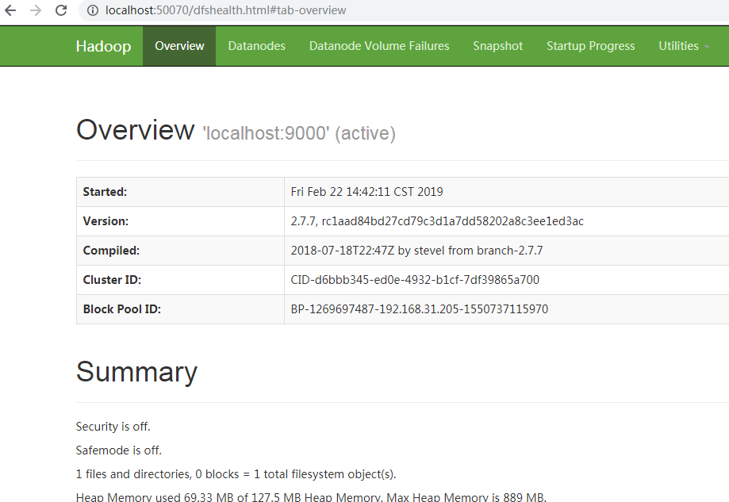

## 一. Hadoop2.7.7源码编译 ###
 如果想整体编译Hadoop源码，需要大费一番周折，因为我只想分析HDFS和Yarn相关的源码，所以我只下载了相关的模块代码，其他代码都是从Maven库中获取
 
### 整体编译需求 ###
Windows系统下，如果想要整体编译，那么需要安装以下组件
* JDK 1.7+
* Maven 3.0 or later
* Findbugs 1.3.9 (if running findbugs)
* ProtocolBuffer 2.5.0 (windows 下安装 protoc-2.5.0-win32，会用到protoc.exe文件)
* CMake 2.6 or newer (if compiling native code), must be 3.0 or newer on Mac
* VS2010(主要用来编译c代码的，会用到msbuild.exe文件)
* ANT

### 简单编译需求 ###
整体编译需要安装的组件太多了，我这里就像分析下代码，所以就采取了简单的编译策略，只编译Protoc序列化文件，不编译c代码
* JDK 1.7+
* Maven 3.0 or later
* protoc-2.5.0-win32.zip(解压后将protoc.exe文件拷贝到java环境的bin下，或者配置到path环境变量中)
* 注释掉所有pom.xml中 maven-antrun-plugin插件中涉及到编译c语言代码的配置
 ###### hadoop-hdfs中pom.xml这个插件注释掉，注释的时候要注意，他有多个编译目标，注释掉默认的即可
       <plugin>
         <groupId>org.apache.maven.plugins</groupId>
         <artifactId>maven-antrun-plugin</artifactId>
         <executions>
           <execution>
        <id>make</id>
        <phase>compile</phase>
        <goals>
          <goal>run</goal>
        </goals>
        <configuration>
          <target>
            <condition property="generator" value="Visual Studio 10" else="Visual Studio 10 Win64">
              <equals arg1="Win32" arg2="${env.PLATFORM}" />
            </condition>
            <mkdir dir="${project.build.directory}/native"/>
             .......
          </target>
        </configuration>
           </execution>
          ......
         </executions>
       </plugin>
  ###### hadoop-common模块中pom.xml以下配注释掉，可以看到是用来编译winutils.exe文件的
       <plugin>
         <groupId>org.codehaus.mojo</groupId>
         <artifactId>exec-maven-plugin</artifactId>
         <executions>
           <execution>
             <id>compile-ms-winutils</id>
             <phase>compile</phase>
             <goals>
               <goal>exec</goal>
             </goals>
             <configuration>
               <executable>msbuild</executable>
               <arguments>
                 <argument>${basedir}/src/main/winutils/winutils.sln</argument>
                 <argument>/nologo</argument>
                 <argument>/p:Configuration=Release</argument>
                 <argument>/p:OutDir=${project.build.directory}/bin/</argument>
                 <argument>/p:IntermediateOutputPath=${project.build.directory}/winutils/</argument>
                 <argument>/p:WsceConfigDir=${wsce.config.dir}</argument>
                 <argument>/p:WsceConfigFile=${wsce.config.file}</argument>
               </arguments>
             </configuration>
           </execution>
            ......
         </executions>
       </plugin>
       
  ###### 修改protoc源码的输出路径
  Hadoop源码想要运行起来，坑实在太多了，用插件生成的protoc源码默认是存放在编译路径下，
  这样用IDEA等工具查看源码时，protoc代码肯定是找不见的，所以需要修改下pom.xml文件中
  源码输出路径，不知道那些Hadoop项目组的大神们平时是怎么开发的     
    
    我是专门用个工程来存放protoc序列化生成的代码，然后用到protoc序列化的工程引入这个工程
    将这种路径
    <output>${project.build.directory}/generated-sources/java</output>
    改成
    <output>${user.dir}/hadoop-protoc/src/main/java</output>

### 编译 ### 
     mvn clean package -Dmaven.test.skip=true  -X  
     
#### 整体编译结果 ###    
    1. 编译后会生成protoc序列化代码
    2.windows
      hadoop.dll
      winutils.exe
    3.linux
      hadoop.lib
      libwinutils.lib
    4. 描述文件
      hadoop.exp
      hadoop.pdb
      winutils.pdb
    其中windows环境中会用到  hadoop.dll、winutils.exe
    这个是整体编译c语言代码生成可执行文件，我这里因为不编译c语言，所以这些程序只能从网上下载了。
    
    已经有大神帮我们编译好了，去里面按照你需要的版本下载：
    https://github.com/steveloughran/winutils
 
## 二. 安装 ###

前面说了编译，下面说说如何安装和启动Hadoop

### 环境 ###
    windows 7-64bit
    jdk-1.8.0_161
    hadoop-2.7.7

#### 注意
    如果JDK安装在Program Files目录下，因为中间有空格，所以启动时会报“JAVA_HOME is incorrect”， 
    直接将Program Files替换为Progra~1即可，或者修改hadoop-evn.cmd文件中JAVA_HOME配置
 
### 安装配置hadoop
#### 1、下载hadoop-2.7.7的tar包
http://hadoop.apache.org/
https://mirrors.tuna.tsinghua.edu.cn/apache/hadoop/common

#### 2、解压并配置环境变量
    复制到D盘根目录直接解压，出来一个目录D:\hadoop-2.7.1，配置到环境变量HADOOP_HOME中
    在PATH里加上%HADOOP_HOME%\bin;

#### 3、下载windows专用二进制文件和工具类依赖库,[下载地址]( https://github.com/steveloughran/winutils)
    hadoop在windows上运行需要winutils支持和hadoop.dll等文件
    在github仓库中找到对应版本的二进制库hadoop.dll和winutils.exe文件，然后把文件拷贝到D:\hadoop-2.7.1\bin目录中去
    注意hadoop.dll等文件不要与hadoop冲突，若出现依赖性错误可以将hadoop.dll放到C:\Windows\System32下一份。

####  4、hadoop环境测试
 启动windows cmd命令行窗口执行hadoop version，显示如下：
     
     Hadoop 2.7.7
     Subversion Unknown -r c1aad84bd27cd79c3d1a7dd58202a8c3ee1ed3ac
     Compiled by stevel on 2018-07-18T22:47Z
     Compiled with protoc 2.5.0
     From source with checksum 792e15d20b12c74bd6f19a1fb886490
     This command was run using /D:/Work/IDE/hadoop-2.7.7/share/hadoop/common/hadoop-common-2.7.7.jar
    

#### 5、最小化配置hadoop伪集群
###### 去D:\hadoop-2.7.1\etc\hadoop找到下面4个文件并按如下最小配置粘贴上去：
###### core-site.xml，注意要修改hadoop.tmp.dir目录，以免数据丢失
    <configuration>
        <property>
            <name>fs.defaultFS</name>
            <value>hdfs://localhost:9000</value>
        </property>    
    	<property>
    		<name>hadoop.tmp.dir</name>
    		<value>/D:/hadoop-2.7.7/data</value>
    	</property>
    </configuration>

###### hdfs-site.xml (将value的路径改为自己的路径，盘符/d:/的前后都有正斜杠)
    <configuration>
        <property>
            <name>dfs.replication</name>
            <value>1</value>
        </property>
    </configuration>

###### mapred-site.xml (拷贝mapred-site.xml.template并改名)
    <configuration>
        <property>
            <name>mapreduce.framework.name</name>
            <value>yarn</value>
        </property>
    </configuration>

###### yarn-site.xml
    <configuration>
        <property>
            <name>yarn.nodemanager.aux-services</name>
            <value>mapreduce_shuffle</value>
        </property>
        <property>
            <name>yarn.nodemanager.aux-services.mapreduce.shuffle.class</name>
            <value>org.apache.hadoop.mapred.ShuffleHandler</value>
        </property>
    </configuration>

#### 6、格式化namenode并启动hadoop
    启动windows cmd命令行窗口执行hdfs namenode -format，待执行完毕没有报错即可，不需要重复format：

#### 启动
    start-dfs.cmd
    stop-dfs.cmd
    
    start-yarn.cmd
    stop-yarn.cmd
    
    start-all.cmd
    stop-all.cmd
 
### 查看hadoop状态 ###
 

 

## 三. 集群安装 ###
`   
   https://blog.csdn.net/hyx1990/article/details/51448514
   https://www.cnblogs.com/julyme/p/5196797.html
   https://www.cnblogs.com/runnerjack/p/7454968.html
`
